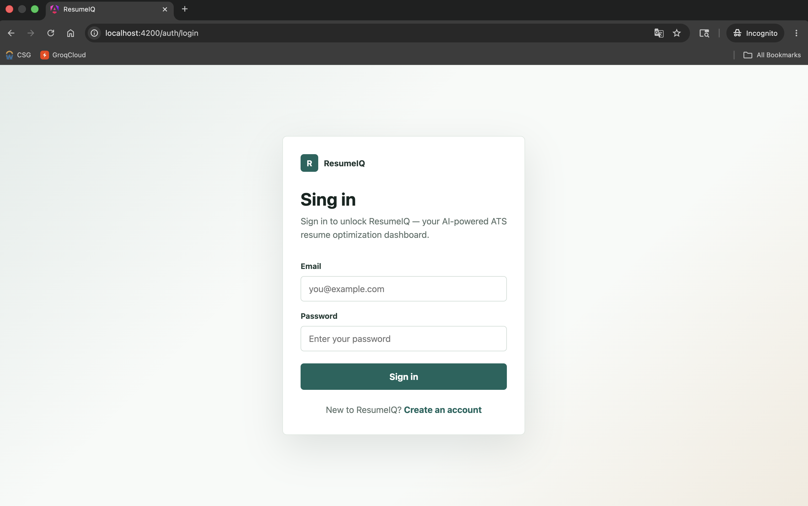
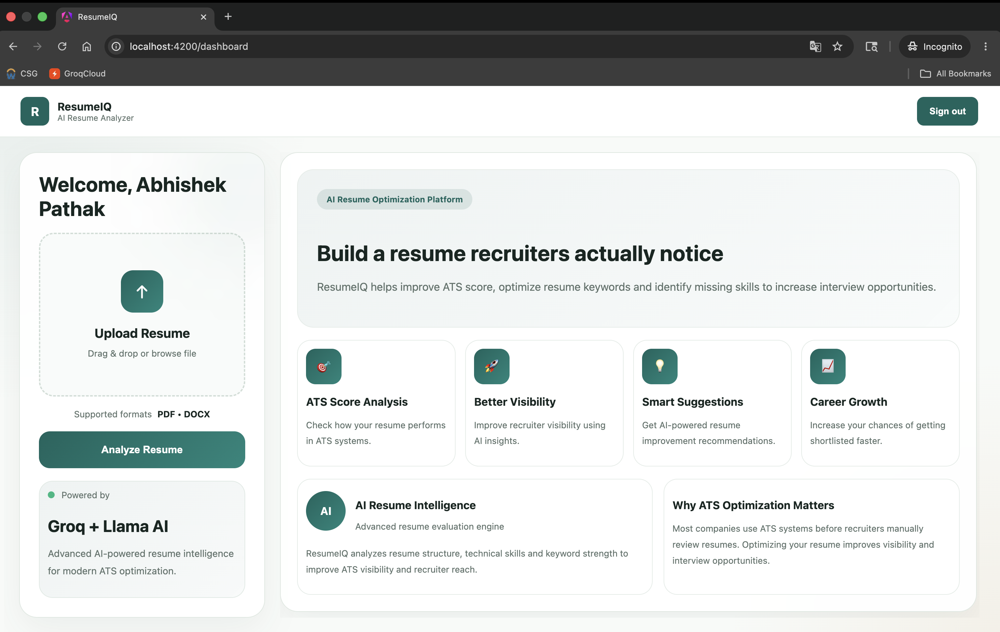
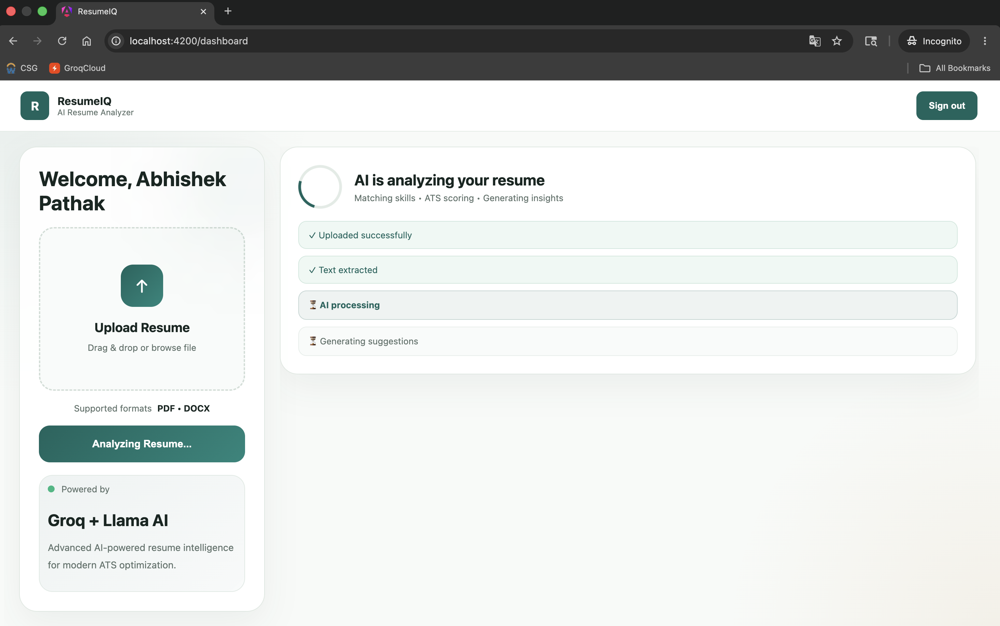
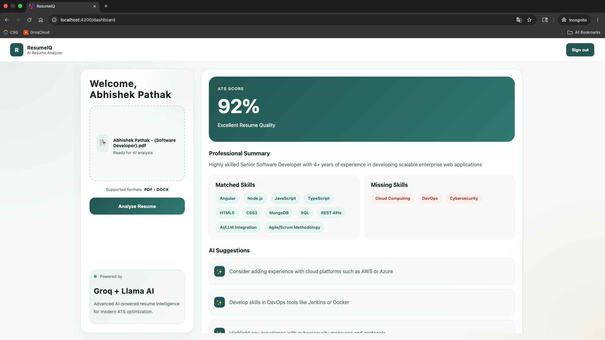

# 🚀 ResumeIQ – AI Powered Resume Analyzer

ResumeIQ is a full-stack AI-powered web application built with **Angular 18, Node.js, Express, MongoDB, and Groq AI**.  
It analyzes resumes and provides **ATS Score, missing skills, and AI-driven improvement suggestions** to help users improve their chances of getting shortlisted.

---

## 📌 Problem Statement

Most resumes get rejected by ATS (Applicant Tracking Systems) before reaching recruiters, and candidates usually don’t know what is missing or how to improve.

---

## 💡 Solution

ResumeIQ helps users by:

- Analyzing resumes using AI
- Generating ATS compatibility score
- Identifying missing skills
- Providing smart improvement suggestions

---

## ✨ Features

- 📄 Upload Resume (PDF/Text support)
- 🤖 AI-powered resume analysis using Groq AI
- 📊 ATS Score generation
- 🧠 Missing skills detection
- 💡 Personalized improvement suggestions
- ⚡ Fast and responsive UI
- 🖥️ Clean and modern dashboard

---

## 🛠 Tech Stack

### Frontend

- Angular 18
- TypeScript
- SCSS

### Backend

- Node.js
- Express.js

### Database

- MongoDB

### AI Integration

- Groq AI API

---

## 🧠 How It Works

1. User uploads resume
2. Backend processes resume data
3. Groq AI analyzes content
4. System generates:
   - ATS Score
   - Missing Skills
   - Improvement Suggestions
5. Results displayed in dashboard UI

---

## 📸 Screenshots

### Login

### Dashboard

### AI Processing

### ATS Score Result

